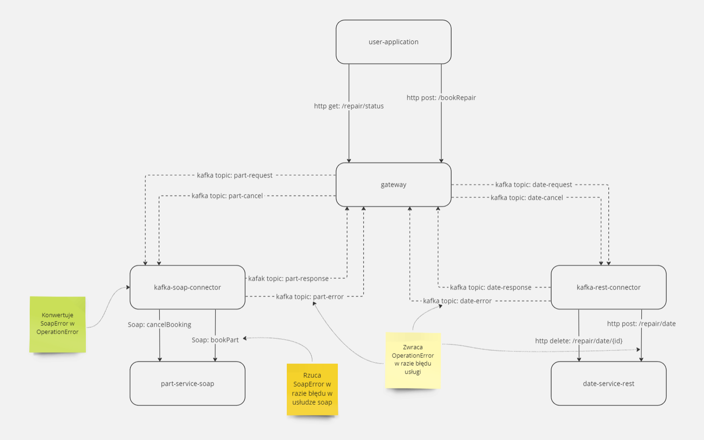

# Microservices app

[PL Polski opis](#opis-projektu)

[ENG English description](#project-description)

[Common information](#common-information)
* [Architecture image](#architecture)
* [Project URLs](#project-urls)
* [Applications ports](#applications-ports)
* [Building and starting application](#application-building-and-starting)


## Opis projektu
### Wstęp
Projekt powstał jako zadanie zaliczeniowe w ramach przedmiotu na studiach, a następnie został przeze mnie rozszerzony i dopracowany. Projekt miał postawione następujące wymagania:

> * Minimum trzy mikro-usługi: brama oraz 2 mikro-usługi implementujące logikę biznesową.
> * Mikro-usługi mają się komunikować przez broker komunikatów.
> * Brama ma dostarczać interfejs RESTful opisany za pomocą OpenAPI, i ma posiadać co najmniej 2 operacje. Pierwsza operacja ma służyć do zlecenia wykonania usługi, druga operacja ma dawać możliwość odbioru wyniku realizacji usługi.
> * Jedna z mikro-usług powinna być klientem usługi WS SOAP, więc należy przygotować również usługę WS SOAP.
> * Aplikacja powinna implementować sagę w celu zagwarantowania ostatecznej spójności przetwarzania.
> * Dodatkowo należy zbudować aplikację webową posiadającą interfejs graficzny użytkownika, który umożliwi zlecenie wykonania usługi dostarczanej przez aplikację mikro-usługową oraz odpytywania jej w celu pozyskania wyniku tego wykonania.
> * Należy zastosować technologię konteneryzacji do rozproszenia mikro-usług oraz aplikacji webowej.

***Mam świadomość, że część zastosowanych rozwiązań architektonicznych nie miałaby zastosowania i racji bytu w prawdziwej aplikacji produkcyjnej tych rozmiarów, jednak zostały one wymuszone przez wymagania prowadzącego. Prowadzący również miał świadomość wad tych wymagań i zaakceptował takie rozwiązanie.*** W szczególności: skoro mikro usługi mają się komunikować przez REST/SOAP, to powinny to robić bezpośrednio i niepotrzebny jest broker komunikatów. Dwa moduły pośrednie odbierające komunikaty z bramy i wywołujące API docelowych usług zostały dodane tylko w celu realizacji postawionych wymagań. Obecnie traktuję je jako zademonstrowanie umiejętności wykorzystania danej technologii.

### Opis działania

Projekt w dużym uproszczeniu symuluje system do rezerwowania naprawy samochodu. Składa się z następujących modułów:
* interfejs użytkownika, pozwalający na dokonanie rezerwacji i asynchroniczne sprawdzenie jej statusu
* brama, przyjmująca żądania od frontendu i rozsyłająca je do usług. Brama implementuje mechanizm sagi: jeżeli w jednej z usług wystąpi błąd, to do drgugiej usługi również wysyłane jest żądanie anulowania. 
* usługa SOAP rezerwacji części
  * usługa zwraca błąd, gdy wybrana marka to Volkswagen
* usługa REST rezerwacji terminu
  * usługa zwraca błąd, gdy `dzień miesiąca naprawy jest podzielny przez 3` lub `godzina mieści jest pomiędzy 20 a 7`
* moduł pośredniczący pomiędzy bramą a usługą części, tłumaczący komunikaty brokera na wywołania SOAP i odpowiedzi SOAP na komunikaty brokera
* moduł pośredniczący pomiędzy bramą a usługą terminu, tłumaczący komunikaty brokera na wywołania REST i odpowiedzi REST na komunikaty brokera

---

---

## Project description

### Background
The project originated as an assignment for a course during my studies, and was later expanded. The project had the following requirements:

> * Minimum of three microservices: a gateway and 2 microservices implementing business logic.
> * Microservices are to communicate through a message broker.
> * The gateway is to provide a RESTful interface described using OpenAPI, and must have at least 2 operations. The first operation is to request the execution of a service, while the second operation provides the ability to retrieve the result of the service execution.
> * One of the microservices should act as a client to a SOAP WS service, therefore a SOAP WS service must also be prepared.
> * The application should implement a saga to ensure eventual consistency of processing.
> * Additionally, a web application with a graphical user interface is to be built, allowing users to request the execution of a service provided by the microservices application and to query it to obtain the result of that execution.
> * Containerization technology is to be used to distribute the microservices and web application.

***I am aware that some of the architectural solutions used would not be applicable or justified in a real-world production application of this size. However, they were mandated by the requirements of the course instructor. The instructor was also aware of the drawbacks of these requirements and accepted such a solution.*** In particular, since microservices are supposed to communicate via REST/SOAP, they should do so directly, and a message broker is unnecessary. The two intermediate modules receiving messages from the gateway and invoking the target service APIs were added solely to meet the stated requirements. Currently, I consider them as a demonstration of the ability to use a specific technology.

### How it works

The project, in a simplified manner, simulates a car repair booking system. It consists of the following modules:

* User interface allowing for reservation and asynchronous status checking.
* Gateway, receiving requests from the frontend and dispatching them to services. The gateway implements a saga mechanism: if an error occurs in one service, a request for cancellation is also sent to the other service.
* SOAP parts reservation service.
  * The service returns an error when the selected brand is Volkswagen.
* REST appointment reservation service.
  * The service returns an error when: `date of repair is divisible by 3` or `hour is between 8 PM and 7 AM`.
* Middleware module between the gateway and the parts service, translating broker messages into SOAP calls and SOAP responses into broker messages.
* Middleware module between the gateway and the appointment service, translating broker messages into REST calls and REST responses into broker messages.


---

---

## Common information

### Architecture


### Project URLs

Part service SOAP WSDL: [http://localhost:8084/soap-service/repair/part?wsdl](http://localhost:8084/soap-service/repair/part?wsdl)

User interface for booking: [http://localhost:8080/user-application/repair](http://localhost:8080/user-application/repair)

User interface for checking status: [http://localhost:8080/user-application/repair/status](http://localhost:8080/user-application/repair/status)

Gateway REST API swagger documentation: [http://localhost:8081/api/swagger-ui/index.html](http://localhost:8081/api/swagger-ui/index.html)

### Applications ports
- kafka: for clients placed in docker 9092, for clients placed in host machine 9093
- user-application: 8080
- gateway: 8081
- kafka-rest-connector: 8082
- date-service-rest: 8083
- part-service-soap: 8084
- kafka-soap-connector: 8085

### Application building and starting

Building application requires:
* maven
* docker

Application can be launched locally without docker, but it requires to change configuration urls to localhost in all modules.

To run application:
* ensure that docker is running
* execute ```mvn -Dmaven.test.skip install spring-boot:build-image``` in `./aznu-parent directory`
* after build finish, following docker images should be available:
```
REPOSITORY                            TAG
kafka-soap-connector                  1.0
date-service-rest                     1.0
gateway                               1.0
part-service-soap                     1.0     
user-application                      1.0 
kafka-rest-connector                  1.0 
```
* execute command `docker compose up -d` in project main directory (where docker-compose.yml file is located)

## Future plans, improvements, development and TODOs:
- [x] Change lib module group id
- [x] Add parent project and hierarchy between modules
- [x] Automatic build of all modules with maven
- [x] Add bootstrap CSS to frontend
- [x] Change endpoints names
- [ ] Add 2 different databases to project (SQL and noSQL)
- [x] Change date service from int to date
- [ ] Orchestration with Docker Swarm
- [ ] Orchestration with Kubernetes
- [ ] Healthcheck for all modules

